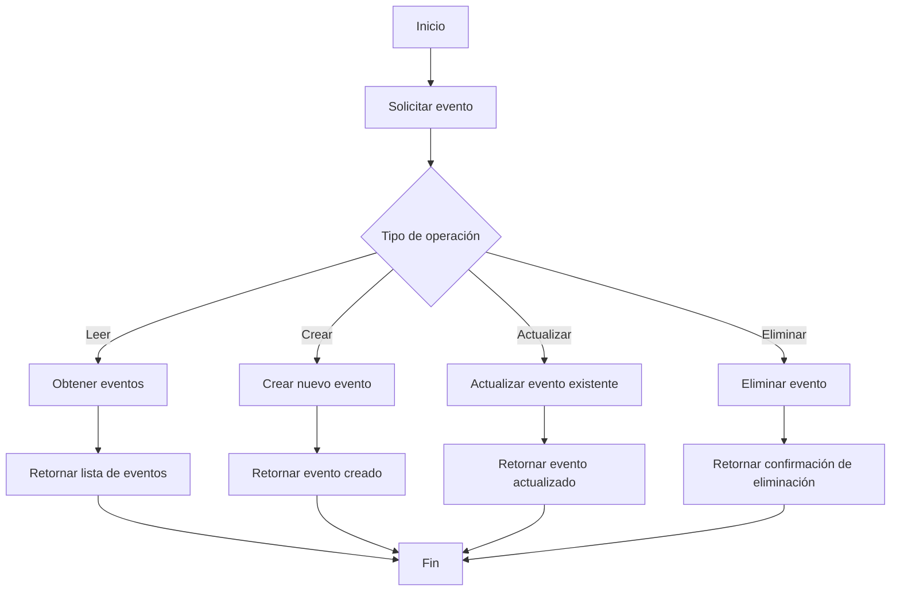

1.0
## Imagen de la aplicacion
La aplicacion puede encontrarse en Docker Hub con el nombre de gus322/vj_evento. Pero para ejecutarse requiere obtener la linea de conexion que trabaje con la misma base de datos en MongoDB que cumpla con el modelo trabajado en el proyecto. Por ejemplo: 
```bash
docker run -e VJ_CONNECTION_STRING="cadena de conexion" -p 9091:9091 gus322/vj_evento:latest
```
## Base de datos y coleccion
La base de datos debe tener el nombre de "juegos_florales" y la coleccion debe tener el nombre de "Evento"

## Readme de  develop 1 

docker build -t eventos_vj .

docker run -d -p 9091:80 eventos_vj

http://localhost:9091/swagger

## Índice

- [Tecnologías Utilizadas](#tecnologías-utilizadas)
- [Configuración del Proyecto](#configuración-del-proyecto)
- [Uso de Git](#uso-de-git)
- [GitHub Actions-(DockerHub)](#github-actions-DockerHub)
- [Publicación](#publicación)
- [Contribución](#contribución)
- [Documentación](#documentación)

  # Proyecto SI-8811-A

Bienvenido al proyecto SI-8811, una API para gestionar eventos utilizando .NET y MongoDB. Este proyecto está diseñado para facilitar la creación, lectura, actualización y eliminación de eventos en un entorno académico.

  
# Integrantes 
 - Jose Luis Jarro C.
 - Gustavo Alonso Valle Bustamante 

# Diagrama de Uso de la API

# Diagrama de Uso de la API

## Componentes del Diagrama
- **Cliente (Móvil/Web)**: La interfaz que interactúa con la API.
- **API en Elastic**: La API que se despliega en Elastic Beanstalk.
- **MongoDB**: La base de datos donde se almacenan los datos.
- **Docker Hub**: Repositorio de imágenes Docker (si estás usando Docker para contenedores).

## Flujo de Datos
1. El **Cliente** realiza solicitudes a la **API**.
2. La **API** se comunica con **MongoDB** para realizar operaciones CRUD (Crear, Leer, Actualizar, Eliminar).
3. **Docker** puede ser utilizado para empaquetar y desplegar la API, mientras que **Docker Hub** sirve como repositorio de la imagen de la API.

## Diagrama de Uso
```plaintext
+---------------+       +------------------+       +-----------------+
|               |       |                  |       |                 |
|  Cliente      | ----> |      API         | ----> |     MongoDB     |
| (Móvil/Web)   |       |   (Elastic)      |       |   (Base de     |
|               | <---- |                  | <---- |    datos)       |
+---------------+       +------------------+       +-----------------+
      |                         |
      |                         |
      |                         |
      |                         |
      +------------------------>|
            (Docker Hub)       |
                                 |
                                 |
                                 +------------------+
                                 |    Docker Hub     |
                                 +------------------+
  ```

## Explicacion del Diagrama DockerHub implementando en la API (GRafic)


## Detalles de las Operaciones
- GET /api/nombre: Obtiene un recurso por nombre desde MongoDB.
- GET /api/id: Obtiene un recurso por ID desde MongoDB.
- PUT /api/id: Actualiza un recurso existente en MongoDB.
- DELETE /api/id: Elimina un recurso de MongoDB

# Link de docker hub 
'''
https://hub.docker.com/layers/palbertt/proyecto-si8811a-2024-ii-u1-apis-y-funciones-jarro-y-valle/latest/images/sha256-c3f301fe87bab319eeea16870779fe9e272c406a5750b307d51e2091440a35f6?context=explore
'''
- 


## Diagrama Api .Net


### Descripción de Componentes APIEventos

- **Cliente**: El usuario o aplicación que hace solicitudes a la API.
- **EventosController**: Controlador que maneja las solicitudes HTTP.
- **MongoDB Eventos**: Base de datos para almacenar los eventos.
- **Validaciones**: Lógica para validar los datos de entrada.
- **Autenticación**: Mecanismo de seguridad para acceso a la API.
- **Manejo de Errores**: Gestión de errores y respuestas adecuadas.
  
### Diagrama de la ApiEventoLocal . net 


## Swagger 

## Pruebas Unitarias Api Eventos 


## Swagger UI
# API Documentation

Este proyecto incluye una API para gestionar eventos. A continuación se detallan los puntos finales de la API definidos en la interfaz de usuario de Swagger.

## Base URL
`http://161.132.48.189:9091/swagger/index.html`

## Endpoints


## Tecnologías Utilizadas

- **.NET Core**: Framework para construir la API.
- **MongoDB**: Base de datos NoSQL para almacenar información de eventos.
- **Git**: Control de versiones.


## Configuración del Proyecto

1. **Clonar el Repositorio**:
   ```bash
   git clone https://github.com/tuusuario/proyecto-si-8811.git
   cd proyecto-si-8811
   ```


## Uso de Git

- Este proyecto utiliza **GitFlow** como modelo de branching. Las ramas se crean para cada nueva característica o corrección de errores, asegurando un flujo de trabajo organizado.
- **Tareas completadas**: Las tareas del proyecto están registradas en **GitHub Projects** y están vinculadas a las respectivas ramas.

## GitHub Actions (DockerHub ) 

- Se han implementado **GitHub Actions** para automatizar la construcción y el despliegue del proyecto, asegurando una integración continua y un despliegue seguro.

## Publicación

- El proyecto ha sido publicado para consumo, pero **no** se encuentra disponible en GitHub.
- Se utilizó **Elastika** para la gestión y despliegue de la API, facilitando el acceso y la escalabilidad del servicio.


## Exposición

- El proyecto ha sido presentado, y se ha utilizado herramientas adecuadas para su exposición. 
- El enfoque y la claridad en la presentación fueron bien recibidos, y se respondieron a las preguntas de manera efectiva.

---

Gracias por tu interés en el proyecto SI-8811. ¡Esperamos tus contribuciones y feedback!

## Swagger UI

## Base URL
`http://161.132.48.189:9091/swagger/index.html`

## Endpoints


### Evento
```json
{
  "id": "string",
  "nombre": "string",
  "fechaInicio": "string($date-time)",
  "fechaTermino": "string($date-time)",
  "facultad": "string",
  "resultado": "string",
  "descripcion": "string"
}
```


## mejoras correcciones 
   - Visualizacion de docker hub con automatizacion ( haciendo referencia al proyecto  de apis y funicones valle y jarro ) 
